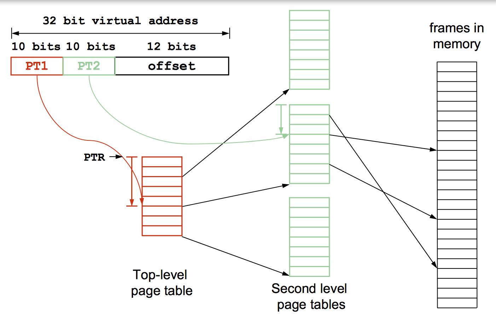

# Lecture 21
March 3, 2017

### Page Table Entry

|Frame Number|Valid|R|W|X|Dirty|Present|
|---|---|---|---|---|---|---|

This takes up about 20 + 6 = 26 rounded up to 32bits

### Challenges of Page Tables

1. Mapping from virtual -> physical must be fast!  
The MMU may require an additional memory reference if implemented badly  
2. Given Page Size = 2^12 bytes, Vaddr are 64 bits wide, and Paddr are 32 bits wide.  
How large is linear page table?  

Virtual Address

|Page # | Offset|
|---|---|
|52|12|

Physical Address

|Frame #|Offset|
|---|---|
|20|12 bits|

We have 2^52 entries (one for each virtual page), each taking up 4 bytes each = _16PB!!_  
Keep in mind this is for _one_ address space's page table. 

## Reducing Page Table Size
### Storing Page Table in Memory 
The page table will be stored in _contiguous_ physical memory.  
The **physical address** of the base of the page table is stored in a special register: the table base register **PTBR** in BLITZ.  
This register is writable only by the kernel and is unique to each address space. Typically stored in **PCB**.

## Challenges
Size of a page table depends on  
1) Size of a page  
2) Size of the virtual address space

### Linear Page Table
Because it stores a page table entry for unused pages, it wastes a lot of memory. To resolve, either  
1. Introduce a **hierarchy**  
2. **Invert** the page table

### Multi-Level Page Table

|PT1|PT2|Offset|
|---|---|---   |
|10b|10b|12b|
|reference top level table|Second level|Frame offset|

PT1 contains the PTBR for the relevant PT2 table. Use the entry in top level to find second-level table.

(+) This reduces the size of the table because some secondary tables _don't need to be allocated_ if not being used.  
(-) But if all addresses are being used this approach ends up using more space than the linear page table.

##### x86 Example 
Uses the 10b/10b/12b structure from before.   
PageDirectory -> PageTable -> Page

All of these tables are 4KB. Then each table, fits in a single page/frame. 

PageDirectory uses 2^10 * 4bytes. Note the PageDirectory entries maintain status on the PageTables they reference: 

|Frame #(20)|Status(10)|
|---|---|

##### Extending beyond 32b

Double the size of each PageDirectory entry. Now it's 512entry * 64b wide = 4KB.

|12 status|40 Frame#| 12 status|
|---|---|---|

Then, a physical address looks like

|Top Level (2)|PT1 (9)|PT2 (9)| Offset (12)|
|---|---|---|---|

There is now _three_ levels of hierarchy in the page table.  
*Fun Fact:* PDBR or CD3 is a register that refers to the top level table base. 

### Inverted Page Table
Store each **frame** of physical memory in the table. Use this as the index in the page table.

##### Linear Search 

|Index|Page#|
|---|---|
|frame0|ox019293
|frame1|0x123939

etc... look for the frame entry with the page # and the index of that entry is the frame#

##### Hash Table
Instead of using linear search (slow), use a hash table to speed up lookups

Hash the page address and procure the frame # from hashtable, search all matching frames for a page match.

|Hash|Frame#|
|---|---|
|H#|F#|
|H#|F# , F#|
