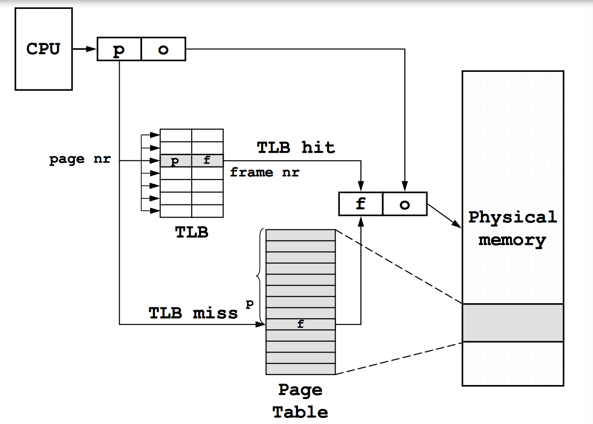

# Lecture 22
March 6, 2017

## Address Translation
With multi level or inverted page tables, each memory access uses up _two_ memory reads.  
MMU Caches page table entries and can lookup in the table for cache misses. This cache is the **Translation Lookaside Buffer (TLB)**. 

Page # (11b) | Frame # (19b) | Status (1+b)
---|---|---

At the very minimum we have the **Valid** bit which shows the TLB entry is maps to real data.  
**Note** BLITZ does _not_ have a TLB. 

### TLB Operations
#### Page Lookup

1. Return frame #
2. **fully associative** search, indexed by page #. 
3. Performed in one cycle

#### TBL Miss

1. Lookup page table for correct entry
2. Fill TLB cache 

##### Data changes  
If the page table entry is changed, set valid bit to 0 in the TLB, or update it to a new entry. This might occur when you change page tables. 

During memory access, if the protection bits are violated, the MMU generates a **protection fault**. 

#### TLB Miss
generate a **TLB Miss Fault**  
After searching through the Page Table and finding the frame#, the data is cached in the TLB and the entire process is _repeated_ from TLB. 

x86 uses hardware to handle tlb miss  
RISC uses software to handle tlb miss

If a frame# cannot be found in page table, generate a **Page Fault**, which indicates the memory has not been allocated yet. 

#### Invalidating TLB
When performing context switch, clear all the valid bits in the page table. 

OR: 

_P#_|F#|Valid|Protection|_AddrSpace ID_|
---|---|---|---|---

record which process owns each entry in the TLB

### Enforcing Protection
Protection bits should be cached in the TLB for *speeeeed*. Whenever a fault eg. write in a page segment, occurs, Kernel handles it. 

