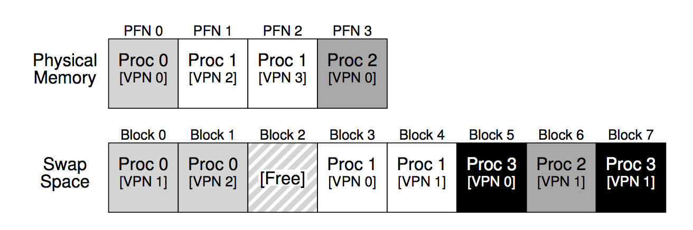

# Lecture 23/24
March 8/10, 2017

### Paging

Allocating fixed size blocks lets us provide _contiguous_ address spaces on _noncontiguous_ physical memory.  
This requires the **MMU** to support **page tables**, and have a **TLB** to cache entries.  

## Virtual Memory
*Problem* what if all process require more RAM than is physically present on the computer?  
*Soln* use disk as **swap space**. This lets us run programs even if we don't have enough ram. 

**implementation note:** some hard disks have a partition for swap space, for better filesys isolation. 



Note, the code segments are stored within the .exe file since they're not modified, and stored there anyway. 

**present bit** indicates if the page is in main memory (1) or on the disk/in exe file of disk (0). 

### page fault handler
This versatile handler is invoked when a page table entry is  
1) valid but not present 
2) not valid at all (raise **segmentation fault**)

**Heap**  
**malloc** and **new** get free pages from a pool of pre-allocated memory. When they run out, a _memory allocation syscall_ is needed. the OS allocates a new frame and inserts a new valid entry into the page table.  
eg: brk()

**Stack**  
Grows via page faults:  
1) faulting address close to stack-> allocate the memory  
2) faulting address far away from stack -> segfault 

In general we can assume we have infinite swap space. 

##### Page Miss, Frame available
- simply figure out the page # from the address
- copy it into the frame 
- update the page table. 
- The original page could come from executable or swap space. 

##### Page Miss, No Free Frames
- Use a *page replacement* algorithm to **evict** page from frame and clear the page table entry.  
- If page table entry was **dirty**, write page to swap space.   
- Now a free frame is available to allocate

#### Performance 
Paging works if there are a lot of free frames.  
Dirty pages use _two_ disk operations for each page fault.

A **Paging Daemon** periodically wakes up to move unused pages to the swap space and mark the frame as clean. If it's needed it still in memory, but if not can be immediately overwritten. 

##### Hardware functionality

```c
VPN = (VirtualAddress & VPN_MASK) >> SHIFT
(Success, TlbEntry) = TLB_Lookup(VPN)
if (Success == True)   // TLB Hit
if (CanAccess(TlbEntry.ProtectBits) == True) Offset = VirtualAddress & OFFSET_MASK PhysAddr = (TlbEntry.PFN << SHIFT) | Offset Register = AccessMemory(PhysAddr)
    else
        RaiseException(PROTECTION_FAULT)
else // TLB Miss PTEAddr = PTBR + (VPN * sizeof(PTE)) PTE = AccessMemory(PTEAddr)
if (PTE.Valid == False)
        RaiseException(SEGMENTATION_FAULT)
    else
        if (CanAccess(PTE.ProtectBits) == False)
            RaiseException(PROTECTION_FAULT)
        else if (PTE.Present == True)
            // assuming hardware-managed TLB
            TLB_Insert(VPN, PTE.PFN, PTE.ProtectBits)
            RetryInstruction()
        else if (PTE.Present == False)
            RaiseException(PAGE_FAULT)
```

In line 9, the segmentation fault operates as a page fault and can either grow the stack or segfault / kill the process. 

### Page Fault 

Case 1) Invalid page -> not mapped.  
OS will either grow stack or segfault

Case 2) Mapped but not in RAM  
OS Will alloc a free frame/evict one and read data from disk (exe or swap). Map page table entry and update present bit. 

## Shared Pages
Multiple processes can share mem by mapping to the same frame in their page tables. Page table entries have different permissions (one writer, one reader). Shared memory can be mapped at different virtual addresses. However this means shared memory pointers will be _invalid_.

**Note** When a frame is moved to swap, all referencing page tables must be updated. This is done via one-to-many mapping ... ?  
**Q** How does this one to many mapping work? Where is it stored? 

The TLB will have one entry for each process. 

### Copy on Write
Fork() creates a new, identical address space for the child. They refer to the same frames until one of them _writes_ to it. 

All frames are set **readonly** and duplicated when a protection fault happens.  
When a frame is evicted, all CoW page table entries must be updated.

#### mmap()
instructs kernel to map a file to memory. This is called a **memory mapped file**
**private** mode does not share with other address spaces (CoW)
**shared** other address spaces can write to the data.

Now we can access a file via the memory interface instead of syscall. 


