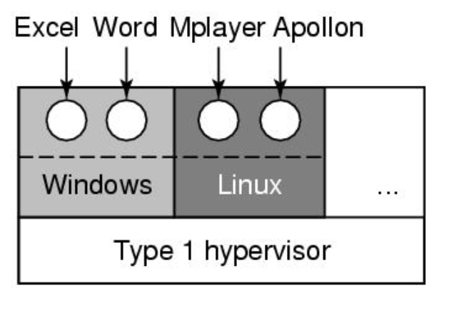
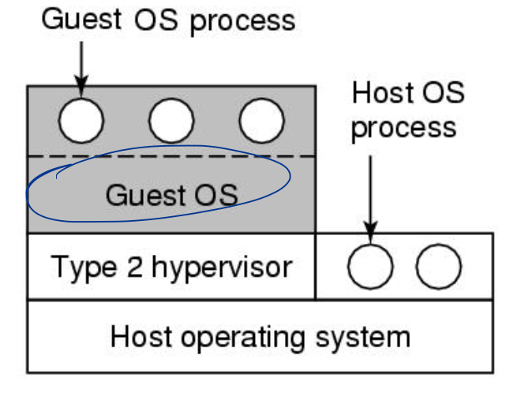

# Virtual Machines
Lecture 34 - April 3, 2017

Appendix B in textbook


**Virtualization** _simulates the interface_ of a physical object while allowing **multiplexing** one device across many virtual instances, and **aggregating** multiple devices into one object. 

Note that **emulation** is not virtualization! In emulation we implement a _different_ physical interface than the hardware we're running on. 

### Why make a virtual machine?
O/S Provides us with two functions we can separate: 

1. multiplexing shared resources for multiple programs (cpu, mem, disk)
2. abstracting hardware interface via common API (syscal) 
 
```
App | App | App      
OS  |  OS | OS    
|   Multiplex   |  <- hypervisor   
|    Hardware   |  
```
The syscalls are provided via a kernel that sits on top of multiplexed resources. 

### VMM aka Hypervisor
Similar to O/S, hypervisors provide a physical interface to the underlying machine. (CPU, mem, disk, network). The OS thinks its running on dedicated hardware. 

Hypervisors are simpler to make than OS, can have less bugs and only exist to provide isolation. OS bugs affect only one VM. 

**Type 1** runs directly in kernel mode. Sits on hardware

**Type 2** runs as an O/S process (host)

### Requirements to VM
**sensitive** instruction can only be run in kernel mode.  
**privileged** instruction causes trap in user mode   
When all sensitive inst are privileged, the arch is *virtualizable*. Priv enforces the sensitive inst via traps. This lets us run user mode programs in an OS. 

Non-sensitive inst do not expose sensitive data, so they can run on physical hardware (super fast!). But this means we use the same physical machine. 

Note x86, ARM were not virtualizable. Then Intel made VT-x (virtualization tech) in 2005. ARM Still not virtualizeable bc some inst. dont trap. 

#### Syscall 
Trap instruction triggers hardware interrupt which is handled by VMM. If done by user, notify OS. If by OS, handle request. 

## Implementation
### Type 1 hypervisor

#### Syscalls
Guest OS/App runs in user mode. When SysCall, app triggers trap -> VMM -> guestOS traphandler (usermode) -> execute syscall -> return to VMM -> return from trap. 

#### Memory
Additional layer of indirection needed to allocate memory for each OS. 

#### TLB Miss
Traditionally, the OS kernel handles a TLB Miss fault and updates the TLB by looking up the page table in memory. 

In the VMM Model,

1. Load address causing TLB fault
2. VMM TLB handler calls OS handler
3. OS does page lookup and updates TLB, triggers VMM
4. VMM rejects (VPN -> PFN) update, and update (VPN -> MFN) instead
5. Guest OS returns from trap
6. VMM returns from trap
7. Resume app execution, instruction retried and gets a TLB hit

Q: How to reconcile the process->guestOS->VMM TLB entry? 

Q: If a TLB entry contains VPN|MFN, then how do you know which process it belongs to? Which OS it belongs to?


### Type 2

Convert all sensitive instructions into trap instructions

1. **Binary Rewriting** a la VMWare, the conversion done at runtime and requires no change to OS code. Hard to do though
2. **Para-Virtualization** (Xen), convert OS source to target the Virt machine specifically. This requires we change OS source though. Easier to do tbh. 

